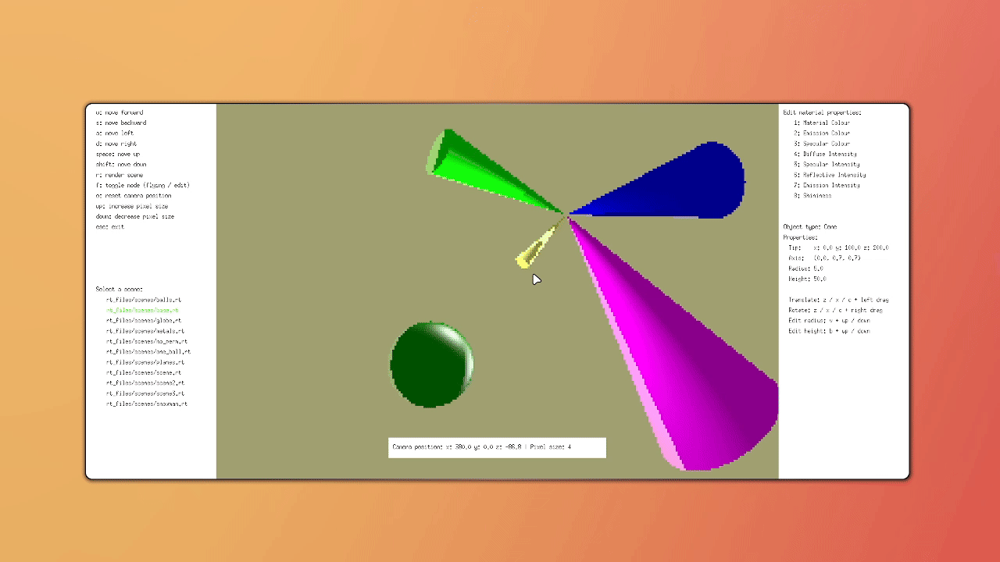
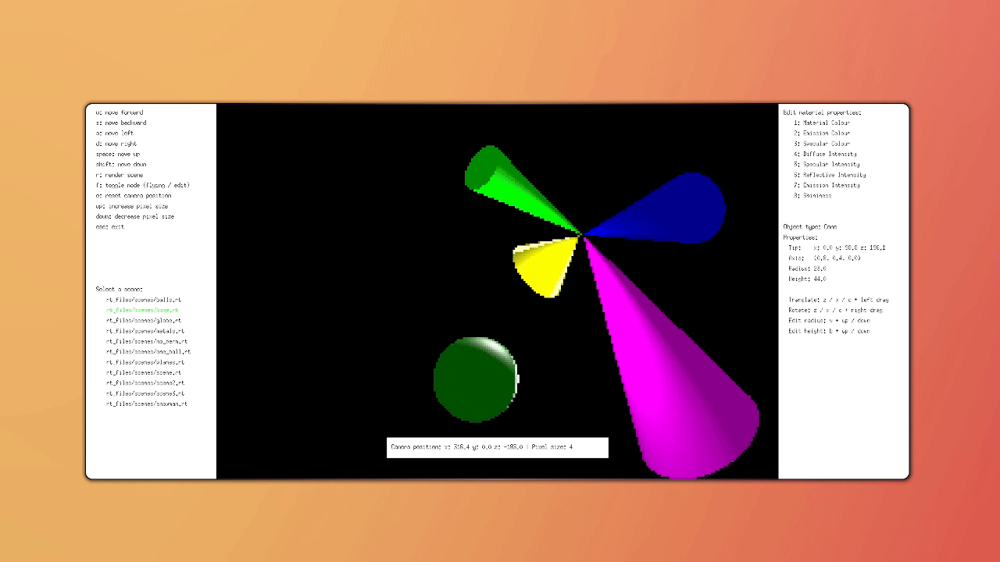
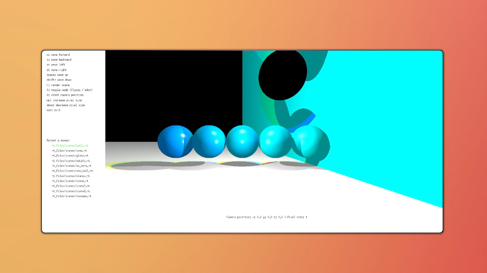
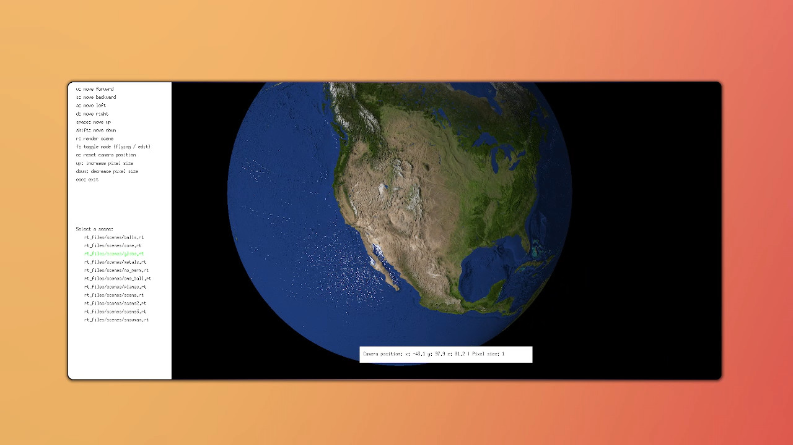
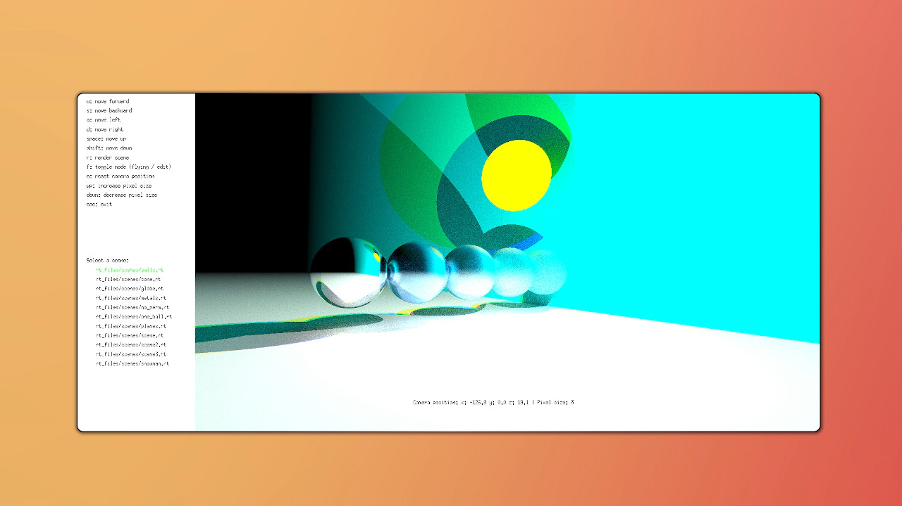

# minirt

A project from 42-cursus aims to write a raytracing renderer.

## 🎮 Features
- [x] Phong model rendering (fast, for moving around and manupulate objects)
- [x] CPU based Multi-Bounce, Multi-Sampling Raytracing.
- [x] Materials, (reflection, etc)
- [x] uv mapping (Normal map, texture map, specular map)
- [x] Camara movement and object Manupulation (materials and transforms)
- [x] multi-threading
- [x] scene selection (click to lead file)

## 🕹️ Controls

| Action         | Key |
|----------------|-----|
| Move           | `W`, `A`, `S`, `D` |
| close     | `ESC` |
| Render the scene with RayTracing     | `R` |
| toogle mode (cam move, object manupulation)     | `F` |
| select object     | mouse left click |

more controls is in the UI

## 📸 Snapshots

click the object in object menupulation mode to select it,
then hold z, x, c, along with left clicking to move item in the corresponding plane


select the object
then hold z, x, c, along with right clicking to rotate item in the corresponding plane


select the object
then hold the corresponding key(should show in right menu) along with arrow up down to change size or materials
(number key swith between different material attribute)


example for phong model


example for UV mapping


example for multi-bounce raytracing
with different level of reflection


example simulating different Metals


## Getting Started <a name = "getting_started"></a>

These instructions will get you a copy of the project up and running on your local machine for development and testing purposes. 

### Prerequisites
1. Linux(preferably debian based) or MacOs.
2. minilibx 


### Installing

if you want to run this on window, need to setup wsl or virtual machine.

clone the project with
```sh
git clone --recurse-submodules https://github.com/ijontan/minirt.git
```
or
```sh
git clone https://github.com/ijontan/minirt.git
git submodule init
git submodule update
```

## Usage <a name = "usage"></a>

build with
```sh
make
```

run with

```sh
./minirt_bonus rt_files/scenes/balls.rt
```

